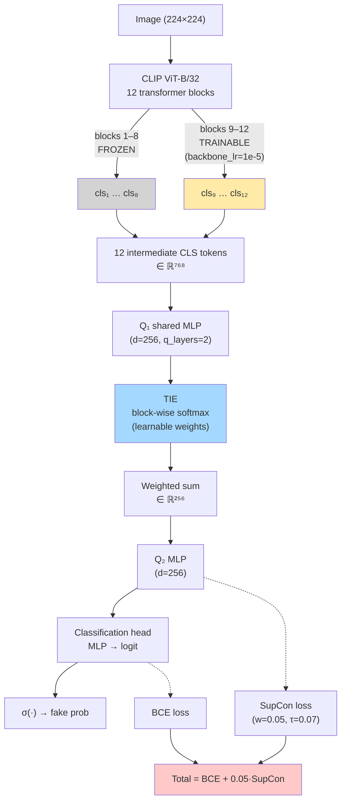

# RINE + MPFT Hybrid

NTIRE 2026 Robust AI-Generated Image Detection Challenge 실험 시리즈.
**RINE** (frozen backbone + TIE multi-block pooling) 과 **MPFT** (partial fine-tuning of last-k blocks) 의 장점을 결합한 하이브리드 레시피의 두 단계 검증 기록.

---

## 1. Concept & Motivation

기존 공개 baseline 두 계열은 각자의 강점과 약점이 있었다.

| 방법 | 핵심 | 강점 | 약점 |
|---|---|---|---|
| **RINE** | CLIP backbone을 **완전히 freeze**, 12개 intermediate CLS token을 TIE (learnable block-wise softmax) 로 가중합 | multi-scale feature 활용, overfit 없음 | frozen 상한에 묶임 |
| **MPFT** | last 4 blocks만 unfreeze 후 학습, **final CLS token만** 사용 | backbone 적응 가능 | 중간층 정보 버림, full FT 시 붕괴 |

두 접근이 서로 **버리는 것을 반대쪽이 지킨다**는 점이 출발점이었다. 가설:

> **H1** — (a) TIE 기반 multi-block CLS 집계 + (b) last-k block partial FT 를 결합하면, 각각을 단독 적용했을 때보다 엄밀히 우수하며, full-CLIP FT에서 관찰되는 붕괴를 피할 수 있다.

두 run 으로 H1 을 검증했다.

- **`1shard_50k/`** — 레시피 자체가 유효한가? (50K samples, PoC)
- **`6shards_277k/`** — 유효하다면 스케일업했을 때 이득이 계속 존재하는가? (277K samples, production run)

---

## 2. Architecture



### ASCII Pipeline

```
Image (224×224)
    ↓
CLIP ViT-B/32 vision encoder (12 transformer blocks)
    ├── blocks 1–8    : FROZEN (requires_grad=False)
    └── blocks 9–12   : TRAINABLE (backbone_lr=1e-5)
    ↓
12 intermediate CLS tokens {cls₁, cls₂, …, cls₁₂} ∈ ℝ⁷⁶⁸
    ↓
Q₁ (shared 2-layer MLP, d=256) → per-block projections
    ↓
TIE: softmax over 12 blocks (learnable importance weights)
    ↓ weighted sum
Q₂ (2-layer MLP, d=256)
    ↓
Classification head (MLP → single logit)
    ↓
σ(·) → fake-probability

Loss = BCE(σ(logit), y) + 0.05 · SupCon(embedding, y)
```

### Phased Training

Full-CLIP unfreeze를 epoch 1부터 돌리면 붕괴하는 현상(MPFT 논문 Table 11 `whole + feat_interp` 참고)을 피하기 위해 **2-phase 스케줄**을 사용한다.

| Phase | Epochs | Trainable params | Head LR | Backbone LR |
|---|---|---|---|---|
| 1 (warm-up) | 1–2 | 529,153 (head + TIE only) | 2e-4 | — |
| 2 (partial FT) | 3–9 | 28,882,177 (head + TIE + last 4 blocks) | 2e-4 | 1e-5 |

Phase 경계에서 optimizer와 AMP GradScaler를 재생성한다.

---

## 3. Two Runs at a Glance

| Run | Folder | Train data | Epochs | Wall-clock | val AUC | val_hard AUC | test AUC | 목적 |
|---|---|---|---|---|---|---|---|---|
| 1-shard PoC | [`1shard_50k/`](1shard_50k/) | 50K (shard 0) | 9 | 2h 19m | 0.9215 (ep 8) | 0.8157 (ep 8) | — | 레시피 검증 |
| Full-shard | [`6shards_277k/`](6shards_277k/) | 277K (shards 0–5) | 9 | 6h 19m | **0.9227** (ep 7) | **0.8339** (ep 7)<br/>0.8418 (ep 9) | 0.7721 (clean 0.8951) | 스케일업 효과 측정 |

### Δ vs. prior baselines (paper Table 11)

| Metric | RINE frozen (250K) | MPFT last-4 (250K) | **Hybrid 6-shard (ours)** |
|---|---|---|---|
| val AUC | 0.9008 | 0.8479 | **0.9227** (+0.0219) |
| val_hard AUC | 0.8132 | 0.7370 | **0.8339** (+0.0207) |

### Δ by data scaling (1-shard → 6-shard)

| Metric | 1-shard | 6-shard | Δ |
|---|---|---|---|
| val AUC | 0.9215 | 0.9227 | +0.0012 (saturated) |
| val_hard AUC | 0.8157 | 0.8339 | **+0.0182** (still gaining) |

---

## 4. Key Findings

1. **Phase-1 warm-up is load-bearing.** Unfreeze 직후(epoch 2→3) val AUC +0.016, val_hard +0.027 로 단일 epoch 최대 점프. Head/TIE가 안정된 뒤에 backbone을 풀어줘야 붕괴를 피한다.
2. **TIE가 hybrid의 본체다.** 두 run 모두 매 epoch에서 **block 7 (frozen 중간층)이 최대 가중치**를 받는다. 6-shard run 에서 block 7 weight 는 0.0864 → 0.0934로 **단조 증가**. 이는 "last-k block 의 final CLS 만 본다"는 MPFT 전제를 정면으로 반박한다 — fine-tune 된 상위 4 블록은 frozen 중간층을 **대체하지 않고 보완**한다.
3. **Clean val 은 포화, val_hard 는 아직 상승.** 5.5× 데이터 → clean +0.0012 (한계) vs hard +0.0182. 정확도가 아니라 **robustness 가 데이터를 더 먹는다**.
4. **Generalization gap: clean vs distorted.** val 0.9227 → test clean 0.8951 (−0.027, 정상) / test distorted 0.6506 (−0.24, 치명적). test 점수 손실의 주원인.
5. **Distortion 실패 모드 4종** (test AUC ≤ 0.60): JPEG-AI/반복 재압축, adversarial CLIP embedding, wmforger, shotnoise. 전부 6-shard 학습 분포에서 과소대표된 계열.
6. **Best epoch은 split 별로 다르다.** 6-shard run: val best = epoch 7, val_hard best = epoch 9. Selection 규칙을 `0.5·val + 0.5·val_hard` 로 바꾸면 epoch 9 가 선택됨 (free gain).

---

## 5. Recommendations (Next Experiments)

Expected-value-per-compute 순:

1. **TAM (Transformation Augmentation Module) 추가** — JPEG-AI 시뮬레이션, shot noise, adversarial noise proxy. distorted test 에 +0.01–0.03 예상. 학습시간만 소모.
2. **12–15 epoch 로 연장 + val_hard-aware selection** — val_hard 는 ep 9 에서도 상승 중. +0.005–0.010 예상, 추가 2h.
3. **Selection metric 재균형** `sel = 0.5·val_auc + 0.5·val_hard_auc` — 무료.
4. **ViT-L/14 로 백본 업그레이드** — clean val 상한 돌파. 메모리 2.5×, 시간 3×.
5. **exp1 (RINE frozen) 체크포인트와 앙상블** — orthogonal feature 합성, test +0.005 예상.
6. **adv_embed_clip 에 대한 hard-negative mining** — 해당 클래스 near-chance (0.55), 5K 합성 adversarial 만으로도 타겟팅 가능.

---

## 6. Reproduce

```bash
# 6-shard full run
CUDA_VISIBLE_DEVICES=0 python -u RINE/train_rine_mpft_hybrid.py \
    --data-root /home/w2/suho/datasets/ntire2026/train \
    --train-shards 0 1 2 3 4 5 \
    --output-dir RINE/outputs/rine_mpft_hybrid_full \
    --checkpoint-prefix rine_mpft_hybrid_full \
    --epochs 9 --warmup-epochs 2 --trainable-last-blocks 4 \
    --head-lr 2e-4 --backbone-lr 1e-5 \
    --batch-size 256 --num-workers 16 --amp \
    --backbone-name models/clip-vit-base-patch32
```

1-shard run 은 `--train-shards 0` 과 `--num-workers 4` 로 동일 명령.

Inference:

```bash
python RINE/inference.py \
    --checkpoint RINE/outputs/rine_mpft_hybrid_full/rine_mpft_hybrid_full_best_model.pt \
    --test-dir data/test_public/test_images \
    --labels-csv data/test_public/test_labels.csv \
    --output test_predictions.csv
```

---

## 7. Folder Layout

```
rine_mpft_hybrid/
├── README.md                    ← this file (concept + overview)
├── 1shard_50k/                  ← PoC run (exp2)
│   ├── history.json
│   ├── results.md
│   ├── run_args.json
│   └── train_log.txt
└── 6shards_277k/                ← production run (exp3)
    ├── history.json
    ├── report.md                ← in-depth analysis
    ├── run_args.json
    ├── test_breakdown.json
    ├── test_breakdown.md
    ├── test_eval.log
    ├── test_predictions.csv
    └── train.log
```

Checkpoints (352 MB each) 은 로컬 `RINE/outputs/` 에만 있고 git 에는 포함하지 않는다.

---

## 8. Bottom Line

- Hybrid 는 **동일 backbone (CLIP ViT-B/32) 에서 val / val_hard 모두 prior best 초과**.
- Clean test AUC (0.8951) 은 val 과 일치; **distorted test AUC (0.6506) 가 유일한 bottleneck**.
- TIE weight 분포가 multi-scale CLS pooling 이 partial FT 의 실질적 동작 기제임을 수치로 증명.
- 다음 실험 (exp4) 은 이 레시피를 고정하고 **TAM augmentation** 으로 distortion 실패 모드를 타겟팅한다.
